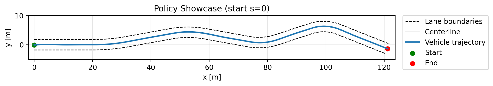
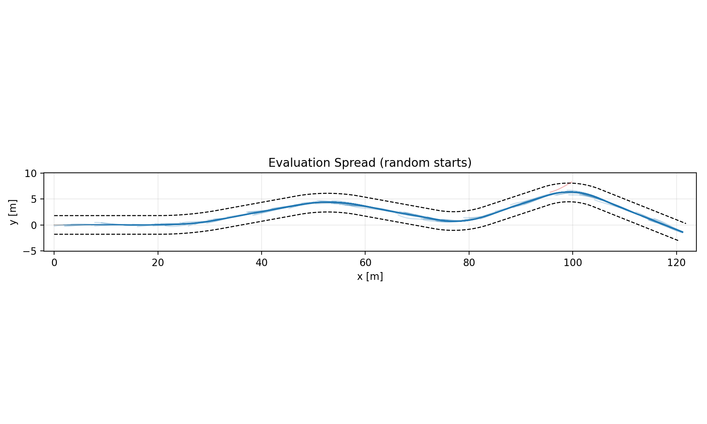
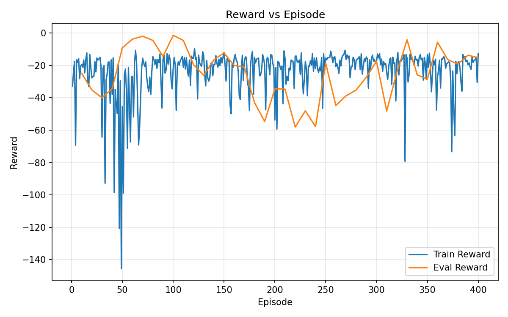

# Lane Following with DDPG

A continuous-control policy that steers a simulated vehicle down a curved lane, trained with DDPG against a hand-written kinematic model instead of a physics engine.



A single rollout from the start of the 124 m lane. The blue line is the vehicle path, the dashed lines are the lane edges, and the policy holds the centerline through all four turns.

## The problem

A vehicle moving at fixed speed has to stay inside a 3.6 m lane with four turns that alternate direction and tighten as the lane goes on, from a 67 m radius down to 14 m. It has only what it can measure locally: how far it is off the centerline, how far its heading is off the lane tangent, and the curvature under it. There is no map and no preview of the road ahead. The control output is a single steering command, and the hard part is that a steering correction does not move the vehicle sideways right away, it changes heading first and lateral position second. Overcorrecting in a turn puts the vehicle over the line a few meters later.

## Approach

- The environment is written from scratch in about 200 lines across `lane.py`, `transition.py`, and `rollout.py`. `lane.py` defines the road as a list of (length, curvature) segments and integrates them into a centerline. `transition.py` advances the error state with a kinematic bicycle model at 4 m/s on a 0.1 s step, with steering limited to 30 degrees per second.
- The policy state is three numbers: lateral offset `d`, heading error `theta`, and local curvature `k`. The action is a steering command squashed to `[-1, 1]` by a `tanh` output. The reward is `-(d^2 + theta^2)`, so there is no shaping term and no bonus for finishing.
- Actor and critic are small MLPs in PyTorch, two hidden layers of 64 units. Training is standard DDPG: replay buffer, target networks with soft updates at tau 0.01, and Gaussian exploration noise of std 0.2 on the action.
- Training rollouts add Gaussian noise to speed, steering, and the state update, so the policy is trained against a noisy plant rather than a clean one.
- Three fixes mattered more than any hyperparameter change. Rollouts were being cut off before the later turns, so the horizon now scales with lane length. Episodes all started near the beginning of the lane, so the policy rarely reached the two tightest turns at 74 m and 96 m during training, and starts are now sampled uniformly along the lane. Checkpoint selection was being made on a single noisy rollout, so evaluation now averages several deterministic ones.
- `generate_results.py` runs the saved policy from many random starting points and reports completion, off-lane rate, and RMS lateral error, which is how the numbers below were measured.

## Results

Measured over 600 rollouts from random starting positions along the lane, in three batches of 200:

- 597 of 600 rollouts drove to the end of the lane. 3 left the lane, an off-lane rate of 0.5 percent. Per batch the rate was 0.0, 0.0, and 1.5 percent.
- Mean RMS lateral error was 0.080 to 0.094 m across the three batches, against a lane half width of 1.8 m.

Every rollout starts with a random lateral offset and heading error, so the policy has to recover to the centerline before it can track it. Two caveats on these numbers. Evaluation runs the transition model with its noise terms off, so this measures the policy against a clean plant even though it was trained against a noisy one. And nothing is seeded, so start positions and initial offsets are redrawn on every run and the numbers move a little between runs.



200 rollouts from random starting points, overlaid. The paths collapse onto the centerline, which is what the low RMS error looks like.



Reward against episode. The orange line is periodic deterministic evaluation, the blue line is training reward including exploration noise, which is why it stays noisy.

## Running it

```bash
python -m venv venv
source venv/bin/activate        # Windows: .\venv\Scripts\Activate.ps1
pip install -r requirements.txt
```

The trained policy and training logs are committed, so the figures can be reproduced without retraining:

```bash
python plot_results.py                      # training curves from training_logs.pt
python generate_results.py --num-eval 200   # policy figures and eval statistics
```

To retrain from scratch, which overwrites `policy.pt` and `training_logs.pt`:

```bash
python train.py
```

## Notes

This started as a course project where the topic was open, and lane following with DDPG was my choice. All of the code here is mine. I used an AI assistant for debugging and for the plotting utilities in `generate_results.py`.
